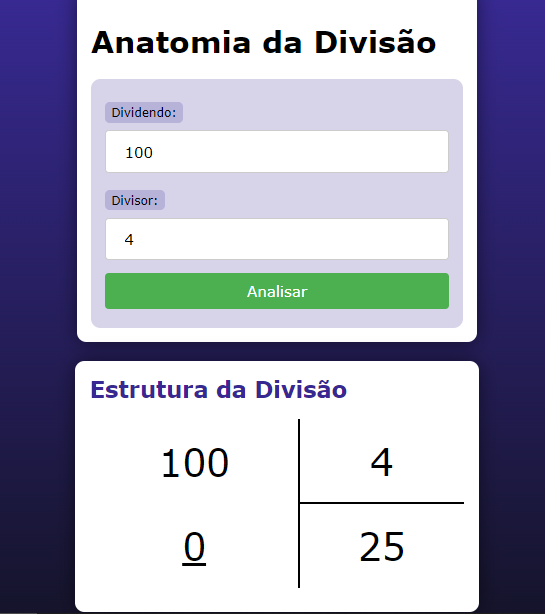

# ANATOMIA DA DIVISAO
👨‍🏫EXIBE A ESTRUTURA DA DIVISÃO ENTRE DOIS NÚMEROS.

  

## DESCRIÇÃO:
- Este aplicativo é uma ferramenta simples para calcular e exibir a estrutura de uma divisão entre dois números. 

- O aplicativo permite ao usuário inserir um dividendo e um divisor, calcula o quociente e o resto da divisão e exibe os resultados em uma tabela. Ele também lida com o caso de divisão por zero, exibindo uma mensagem de erro apropriada.

## EXECUTANDO O PROJETO:
1. **Abrir a Página Inicial**
   - Ao abrir a página inicial do aplicativo, você verá um formulário com dois campos de entrada: um para o dividendo e outro para o divisor.

2. **Inserir os Valores**
   - Digite o valor do dividendo no campo "Dividendo".
   - Digite o valor do divisor no campo "Divisor".

3. **Enviar o Formulário**
   - Clique no botão "Analisar" para enviar o formulário. Os valores serão enviados para a mesma página usando o método GET.

4. **Visualizar os Resultados**
   - Se os valores inseridos forem válidos e o divisor não for zero, a página será recarregada e exibirá uma seção com a estrutura da divisão, mostrando o dividendo, o divisor, o quociente e o resto.
   - Se o divisor for zero, uma mensagem de erro será exibida, indicando que a divisão por zero não é permitida.

## NÃO SABE?
- Entendemos que para manipular arquivos em `HTML`, `CSS` e outras linguagens relacionadas, é necessário possuir conhecimento nessas áreas. Para auxiliar nesse aprendizado, oferecemos cursos gratuitos disponíveis:
* [CURSO DE HTML E CSS](https://github.com/VILHALVA/CURSO-DE-HTML-E-CSS)
* [CURSO DE JAVASCRIPT](https://github.com/VILHALVA/CURSO-DE-JAVASCRIPT)
* [CONFIRA MAIS CURSOS](https://github.com/VILHALVA?tab=repositories&q=+topic:CURSO)

## CREDITOS:
- [PROJETO BASEADO NO "ANATOMIA DE UMA DIVISAO"](https://github.com/VILHALVA/ANATOMIA-DE-UMA-DIVISAO)
- [PROJETO FEITO PELO VILHALVA](https://github.com/VILHALVA)

